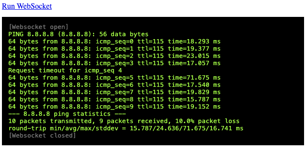

Saturday 2024.01.13 11:16:29

**WebSockets Demo: Basics**
===========================

WebSocket with a Python backend using std lib's `asyncio`: it runs a `ping` on the
 backend and sends stdout live to the frontend via WebSocket.

Inspired by this: https://stackoverflow.com/a/57541504/1969672

```sh
$ python3 -m venv .venv
$ source .venv/bin/activate
$ pip install -r requirements.txt
# Launch the server:
$ python main.py
```
And open `index.html` with Chrome.


