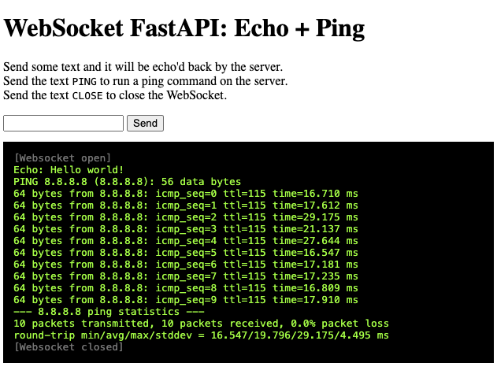

Saturday 2024.01.13 11:16:29

**WebSockets Demo: FastAPI**
============================

WebSocket with a Python backend using FastAPI: it runs a `ping` on the
 backend and sends stdout live to the frontend via WebSocket.

Inspired by this: https://fastapi.tiangolo.com/advanced/websockets/

```sh
$ python3 -m venv .venv
$ source .venv/bin/activate
$ pip install -r requirements.txt
# Launch the server:
$ uvicorn main:app --reload
```
And with Chrome open: http://127.0.0.1:8000.


