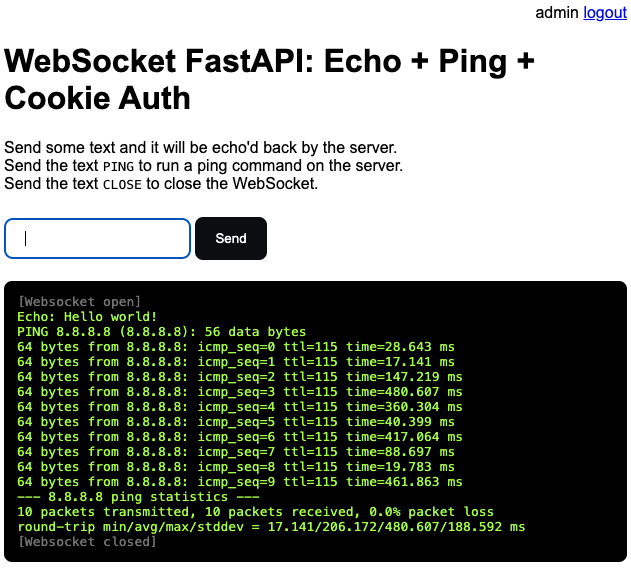

Saturday 2024.01.13 11:16:29

WEBSOCKETS DEMO: FASTAPI

**WebSockets Demo: FastAPI w/ Cookie Auth**
===========================================

WebSocket with a Python backend using FastAPI with Cookie Auth: it runs a `ping` on the
 backend and sends stdout live to the frontend via WebSocket.

WebSocket inspired by this: https://fastapi.tiangolo.com/advanced/websockets/
Cookie auth inspired by: https://gist.github.com/rochacbruno/3b8dbb79b2b6c54486c396773fdde532

```sh
$ python3 -m venv .venv
$ source .venv/bin/activate
$ pip install -r requirements.txt
$ pip install -r requirements-dev.txt
# Launch the server:
$ uvicorn main:app --reload
```
And with Chrome open: http://127.0.0.1:8000.


